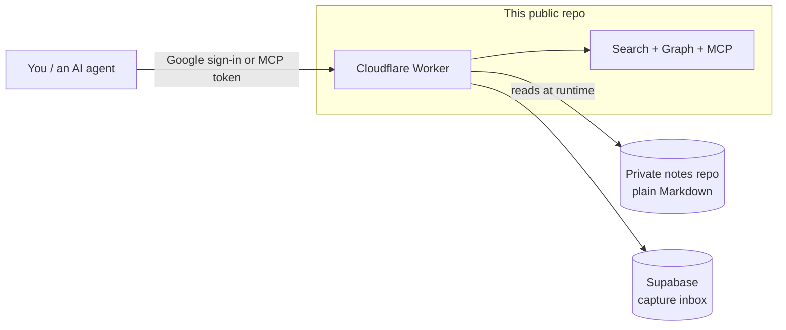

# vbrain

> **TL;DR** — A private, AI-queryable **second brain** — as a reusable engine.
> Write plain Markdown notes; vbrain gives you full-text search, a live
> knowledge graph, an MCP server so AI agents can query your notes, quick-capture,
> and a validator that keeps everything consistent. This repo is the engine plus a
> **fictional demo brain** so you can try it end-to-end.

vbrain turns a folder of Markdown into a fast, searchable, agent-friendly
knowledge base — served by a single Cloudflare Worker, gated to just you. Your
notes stay in a **separate private repo**; this repo is only the engine and a
demo persona ([Alex Rivera](about-me.md)) with fake content.

> This is a demo/showcase. The notes under [projects/](projects/README.md),
> [learnings/](learnings/README.md) and friends are **fictional** — they exist to
> demonstrate the engine, not to describe a real person.

## Why it's interesting

- **Notes are just Markdown** — no lock-in, diffable, portable. The engine reads
  them; it never owns them.
- **Content and engine are separated** — the Worker fetches notes at runtime from
  a *private* content repo, so you can open-source the engine without leaking a word.
- **Built for AI agents** — an MCP server exposes your brain as tools any model can call.

## Features

| Area | What it does |
|------|--------------|
| **Search** | A real BM25-lite engine — diacritic folding, prefix + token matching, IDF/length norm, typo tolerance, operators (`"phrase"`, `-exclude`, `section:`). One shared `lib.js` powers the UI and the MCP server. |
| **Knowledge graph** | Dependency-free force-directed SVG of every note and its links; click to open. Plus `scripts/graph.mjs` for orphans/hubs/backlinks. |
| **MCP server** | JSON-RPC 2.0 (`/mcp`) with `search_brain`, `get_note`, `list_notes`, `get_backlinks`, `add_capture` — so Claude/Cursor/Codex can query and append to your brain. |
| **Quick capture** | A capture box + inbox (Supabase); a bot can push a note with a bearer token, you file it later. |
| **Auth** | Supabase Google sign-in; the Worker serves content only to one allowed email. Strict CSP + security headers on every response. |
| **PWA** | Offline app shell; the shell is cached, your content never is. |
| **Guardrails** | `scripts/validate.mjs` enforces structure, links, MAP coverage, and a **secret/PII scanner**; `doctor.mjs` gives a health score; CI runs it all. |

## Architecture



The engine ([site/](site/README.md)) is public and content-free. Your real notes
live in a private repo the Worker reads with a read-only token. This demo repo
keeps its (fake) notes alongside the engine so it runs out of the box.

## Try the demo locally

```bash
cd site
npm install
node dev-server.mjs      # serves the fake brain with no auth/token needed
# open http://localhost:8787  (graph at /#/graph)
```

Then explore the notes starting at [MAP.md](MAP.md), or run the tooling:

```bash
node scripts/validate.mjs      # structure, links, MAP coverage, secret scan
node scripts/graph.mjs         # orphans, hubs, backlinks
node scripts/doctor.mjs        # health score
cd site && npm test            # the engine's test suite
```

## Make it your own

1. **Fork** this repo — it becomes your public engine.
2. Put your real notes in a **separate private repo** (same shape: `# H1`, a
   `> TL;DR`, register each in [MAP.md](MAP.md); see [CONVENTIONS.md](CONVENTIONS.md)).
3. Set the placeholders in [site/wrangler.toml](site/wrangler.toml)
   (`ALLOWED_EMAIL`, `GH_OWNER`, `GH_REPO`, Supabase) and add secrets with
   `wrangler secret put` (`GITHUB_TOKEN`, etc.).
4. `wrangler deploy`. Sign in — only your email is ever served content.

## How it's organized

- [AGENTS.md](AGENTS.md) — how an AI agent should read/write the brain.
- [CONVENTIONS.md](CONVENTIONS.md) — the rulebook that keeps it consistent.
- [RITUALS.md](RITUALS.md) — repeatable workflows (capture, review, gap-check).
- [site/](site/README.md) — the Worker, SPA, search, and MCP server.
- [scripts/](scripts/README.md) — the zero-dependency validator/graph/doctor tools.

## License

MIT — see [LICENSE](LICENSE).
